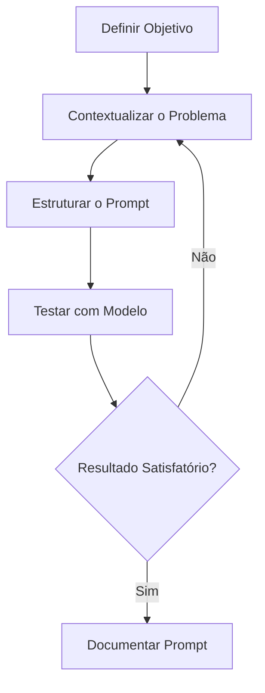

<!-- BEGIN_DOCS -->
<div align="center">

<a name="readme-top"></a>


Hello Human 👽! Bem-vindo ao meu repositório 👋

[](https://www.conventionalcommits.org/en/v1.0.0/)
[](https://semantic-release.gitbook.io/semantic-release/usage/configuration)
[](https://jetpack.io/devbox/docs/contributor-quickstart/)

Pronto para aprender sobre Prompt Engineering? 🚀 (ou então perderá seu emprego 🤡 rsrsrs)

</div>

# Sumário

<details>
  <summary><strong>Expandir</strong></summary>

- [Visão Geral](#visao-geral)
  - [Objetivo](#objetivo)
  - [Contexto e Motivação](#contexto-e-motivacao)
  - [Audiência](#audiencia)
- [Estrutura de Pastas](#estrutura-de-pastas)
- [Prompt Engineering](#prompt-engineering)
  - [O que é?](#o-que-e)
  - [Por que é importante?](#por-que-e-importante)
  - [Como criar bons prompts?](#como-criar-bons-prompts)
  - [Estratégias de Criação](#estrategias-de-criação)
  - [Melhores Práticas](#melhores-praticas)
- [Referências](#referencias)
- [Contribuição](#contribuicao)
- [Versionamento](#versionamento)
- [Troubleshooting](#troubleshooting)
- [Show your support](#show-your-support)

<p align="right">(<a href="#readme-top">back to top</a>)</p>

</details>

# Visão Geral

## Objetivo

Nesse repositório apresento para vocês um guia prático sobre Prompt Engineering, com dicas, estratégias e boas práticas para criar prompts eficazes. Além disso, compartilho exemplos de prompts em diferentes áreas, como DevOps, Data Science e General, que utilizo em projetos do dia a dia.

## Contexto e Motivação

Com o avanço da IA, aprender a estruturar prompts de forma eficaz se tornou uma habilidade essencial. Um bom prompt pode melhorar significativamente as respostas de modelos como ChatGPT, Claude e Bard. Este projeto foi criado para documentar, compartilhar e aprimorar prompts usados em diferentes contextos.

## Audiência

- Profissionais de tecnologia (DevOps, Engenheiros de Software, Cientistas de Dados)
- Estudantes e pesquisadores interessados em IA generativa
- Desenvolvedores buscando melhorar a interação com LLMs

# Estrutura de Pastas

Aqui, irei organizar meus prompts em uma estrutura de pastas que reflita as diferentes seções ou categorias abordadas. Abaixo, dou um exemplo dessa organização:

```
/prompt-management
│── /prompts
│   ├── devops
│   │   ├── troubleshooting.md
│   │   ├── automation.md
│   ├── data-science
│   │   ├── model-training.md
│   │   ├── data-cleaning.md
│   ├── general
│   │   ├── brainstorming.md
│   │   ├── summarization.md
│── README.md
```

**Regras:**

- Cada prompt em arquivo `.md` separado.
- Metadados no front-matter (ex: `tags: [aws, terraform]`).
- Use o delimitador `-` para separar palavra do arquivo (ex: `debug-container-logs.md`).
- Use nomes descritivos e concisos.

Esta estrutura facilita o acesso rápido às informações e permite um gerenciamento mais eficiente do repositório.

---

# Prompt Engineering

Nessa sessão vamos explorar o conceito de Prompt Engineering e como ele pode ser aplicado para melhorar a interação com modelos de IA.

## O que é?

Prompt Engineering é a prática de projetar e refinar entradas (prompts) para modelos de IA, garantindo que gerem respostas mais precisas e úteis.

## Por que é importante?

- Maximiza a eficiência e qualidade das respostas
- Reduz ambiguidades e erros nas saídas do modelo
- Permite automação de tarefas e ganho de produtividade

## Como criar bons prompts?

1. **Seja claro e específico**: Evite ambiguidades e forneça contexto.
2. **Defina formato esperado**: Exemplo: "Me dê a resposta em JSON."
3. **Use exemplos**: Exemplo: "Transforme este texto em um resumo curto. Exemplo: ..."
4. **Ajuste e itere**: Teste variações para otimizar a resposta.



## Estratégias de Criação

- **Zero-shot prompting**: Perguntar diretamente sem fornecer exemplos.
- **One-shot prompting**: Oferecer um exemplo para orientar a resposta.
- **Few-shot prompting**: Fornecer vários exemplos para moldar a saída do modelo.
- **Chain-of-thought prompting**: Induzir o modelo a explicar seu raciocínio.
- **Role prompting**: Definir o papel do modelo para contextualizar a resposta.
- **Step-by-step prompting**: Dividir a tarefa em etapas sequenciais.

# Conclusão

A Engenharia de Prompt é uma habilidade crítica para maximizar o potencial dos LLMs em qualquer área. Ao organizar prompts em seções temáticas e seguir boas práticas, você pode:

- Acelerar tarefas diárias.
- Melhorar a consistência das saídas.
- Facilitar o conhecimento coletivo da equipe.

<p align="right">(<a href="#readme-top">back to top</a>)</p>

# Referências

Links relevantes para esse projeto:

- [Prompt Engineering: A Guide to Building Better AI Models](https://www.technologyreview.com/2021/10/06/1036241/prompt-engineering-guide-ai-models/)
- [How to Write Good Prompts for AI Models](https://www.technologyreview.com/2021/10/06/1036241/prompt-engineering-guide-ai-models/)
- [OpenAI GPT-3: Language Models are Few-Shot Learners](https://arxiv.org/abs/2005.14165)

<p align="right">(<a href="#readme-top">back to top</a>)</p>

# Contribuição

Gostaria de contribuir? Isso é ótimo! Temos um guia de contribuição para te ajudar. Clique [aqui](CONTRIBUTING.md) para lê-lo.

<p align="right">(<a href="#readme-top">back to top</a>)</p>

# Versionamento

Para verificar o histórico de mudanças do projeto, acesse o arquivo [**CHANGELOG.md**](CHANGELOG.md).

<p align="right">(<a href="#readme-top">back to top</a>)</p>

# Troubleshooting

Se você tiver algum problema, [abra uma issue nesse projeto](https://github.com/homelabsz/helm-charts/issues).

<p align="right">(<a href="#readme-top">back to top</a>)</p>

# Show your support

<div align="center">

Dê uma ⭐️ para esse projeto se ele te ajudou!


<br>
<br>

Feito com 💜 por [mim](https://github.com/lpsm-dev) :wave: inspirado no [readme-md-generator](https://github.com/kefranabg/readme-md-generator)

</div>

<p align="right">(<a href="#readme-top">back to top</a>)</p>
<!-- END_DOCS -->
