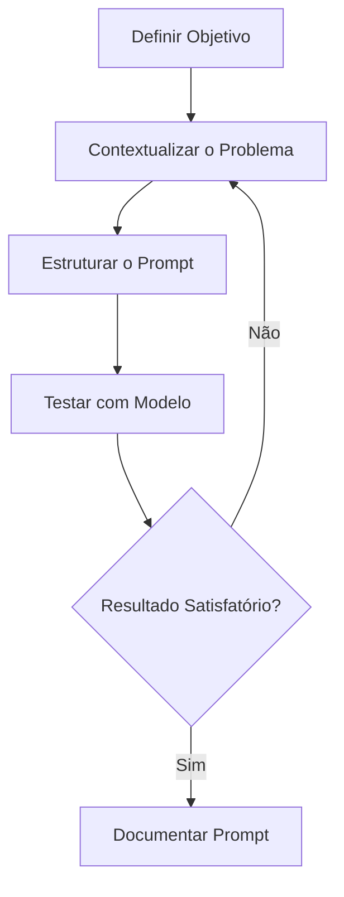

<!-- BEGIN_DOCS -->
<div align="center">

<a name="readme-top"></a>


Hello Human 👽! Bem-vindo ao meu repositório 👋

[](https://www.conventionalcommits.org/en/v1.0.0/)
[](https://semantic-release.gitbook.io/semantic-release/usage/configuration)
[](https://jetpack.io/devbox/docs/contributor-quickstart/)

Pronto para aprender sobre Prompt Engineering? 🚀 (ou então perderá seu emprego 🤡 rsrsrs)

</div>

# Sumário

<details>
  <summary><strong>Expandir</strong></summary>

<!-- START doctoc generated TOC please keep comment here to allow auto update -->
<!-- DON'T EDIT THIS SECTION, INSTEAD RE-RUN doctoc TO UPDATE -->

- [Visão Geral](#vis%C3%A3o-geral)
  - [Objetivo](#objetivo)
  - [Contexto e Motivação](#contexto-e-motiva%C3%A7%C3%A3o)
  - [Audiência](#audi%C3%AAncia)
- [Estrutura de Pastas](#estrutura-de-pastas)
- [Gen AI](#gen-ai)
  - [O que é?](#o-que-%C3%A9)
  - [O que são Foundation Models?](#o-que-s%C3%A3o-foundation-models)
  - [O que são Large Language Models (LLMs)?](#o-que-s%C3%A3o-large-language-models-llms)
- [Prompt Engineering](#prompt-engineering)
  - [O que é?](#o-que-%C3%A9-1)
  - [Por que é importante?](#por-que-%C3%A9-importante)
  - [Como criar bons prompts?](#como-criar-bons-prompts)
  - [Estratégias de Criação](#estrat%C3%A9gias-de-cria%C3%A7%C3%A3o)
  - [Avaliação de Prompts](#avalia%C3%A7%C3%A3o-de-prompts)
  - [Relação entre FM, LLMs e Prompt Engineering](#rela%C3%A7%C3%A3o-entre-fm-llms-e-prompt-engineering)
- [Conclusão](#conclus%C3%A3o)
- [Referências](#refer%C3%AAncias)
- [Contribuição](#contribui%C3%A7%C3%A3o)
- [Versionamento](#versionamento)
- [Troubleshooting](#troubleshooting)
- [Show your support](#show-your-support)

<!-- END doctoc generated TOC please keep comment here to allow auto update -->

<p align="right">(<a href="#readme-top">back to top</a>)</p>

</details>

# Visão Geral

## Objetivo

Nesse repositório apresento para vocês um guia prático sobre **Prompt Engineering**, com dicas, estratégias e boas práticas para crição de prompts eficazes. Além de fazer uma breve introdução sobre esse tema, compartilho prompts de diferentes áreas, como DevOps, Data Science e Business, que utilizo em projetos do dia a dia para acelerar tarefas (a coisa tá feia kkkk).

## Contexto e Motivação

A true da true meu jovem camarada, é que com o avanço da IA, todos nós estamos com medo de perder nossos empregos. "Ain, mas eu sou um cara foda, não vou ser substituído por uma máquina, tenho várias certificações e sou especialista". Amigão, sinto muito em te informar, mas a IA já está sendo usada para automatizar tarefas em diversas áreas e a sua não é exceção 🤭.

No final os humanos sentem medo do desconhecido. Todos nós, variando de grau, tememos o que não entendemos. E é por isso que estou aqui! Quero te ajudar a entender como você pode se beneficiar da IA, ao invés de ser substituído por ela, utilizando técnicas de Prompt Engineering para melhorar a interação com modelos de linguagem de grande escala (LLMs).

## Audiência

- Profissionais de tecnologia (DevOps, Engenheiros de Software, Cientistas de Dados).
- Pessoas buscando melhorar a interação com LLMs.

<p align="right">(<a href="#readme-top">back to top</a>)</p>

# Estrutura de Pastas

Aqui, irei organizar meus prompts em uma estrutura de pastas que reflita as diferentes seções ou categorias que podemos ter em alguma área de nossa vida. Abaixo, dou um exemplo dessa organização:

```
/prompt-management
│── /prompts
│   ├── devops
│   │   ├── troubleshooting.md
│   │   ├── automation.md
│   ├── data-science
│   │   ├── model-training.md
│   │   ├── data-cleaning.md
│   ├── general
│   │   ├── brainstorming.md
│   │   ├── summarization.md
│── /templates
│   ├── base-template.md
│   ├── advanced-template.md
│── README.md
```

- A pasta [prompts](./prompts) contém os prompts organizados por categorias.
- A pasta [templates](./templates) contém modelos de prompts utilizados como base para criação de novos prompts.

**Regras:**

- Cada prompt é descrito em um arquivo `.md` separado.
- Metadados front-matter (ex: `tags: [aws, terraform]`) são colocados no início do arquivo.
- Use o delimitador `-` para separar palavra do arquivo (ex: `debug-container-logs.md`).
- Use nomes descritivos e concisos.

Essa estrutura facilita o acesso rápido às informações e permite um gerenciamento mais eficiente do repositório, além de paltar

<p align="right">(<a href="#readme-top">back to top</a>)</p>

# Gen AI

## O que é?

A IA Generativa é um ramo da inteligência artificial focado na criação de novos conteúdos, como texto, imagens, áudio e código. Ela utiliza modelos avançados de machine learning para aprender padrões de grandes volumes de dados e gerar respostas criativas e contextuais.

## O que são Foundation Models?

Foundation Models são modelos de IA altamente escaláveis e treinados em grandes quantidades de dados não específicos para uma única tarefa. Eles servem como base para diversas aplicações e podem ser ajustados para domínios específicos.

**Principais Características**:

- Treinados em dados genéricos e refinados para tarefas específicas.
- Alta adaptabilidade para aplicações em diversas indústrias.
- Exemplo: O GPT-4 é um Foundation Model ajustado para aplicações como ChatGPT e Copilot.

## O que são Large Language Models (LLMs)?

Large Language Models (LLMs) são modelos de inteligência artificial treinados em vastos conjuntos de dados textuais. Eles utilizam arquiteturas de deep learning, como Transformers, para gerar respostas coerentes e contextuais baseadas em uma entrada textual.

**Principais Características**:

- São capazes de compreender e gerar texto em linguagem natural.
- Podem realizar tarefas como resumo, tradução, geração de código e análise de sentimentos.
- Exemplos: GPT-4, PaLM, Claude e LLaMA.

# Prompt Engineering

Nessa sessão vamos explorar o conceito de Prompt Engineering e como ele pode ser aplicado para melhorar a interação com modelos de IA.

## O que é?

Prompt Engineering é a prática de projetar e refinar entradas (prompts) para modelos de IA, garantindo que gerem respostas mais precisas e úteis.

## Por que é importante?

- Maximiza a eficiência e qualidade das respostas
- Reduz ambiguidades e erros nas saídas do modelo
- Permite automação de tarefas e ganho de produtividade

## Como criar bons prompts?

1. **Seja claro e específico**: Evite ambiguidades e forneça contexto.
2. **Defina formato esperado**: Exemplo: "Me dê a resposta em JSON."
3. **Use exemplos**: Exemplo: "Transforme este texto em um resumo curto. Exemplo: ..."
4. **Ajuste e itere**: Teste variações para otimizar a resposta.



## Estratégias de Criação

- **Zero-shot prompting**: Perguntar diretamente sem fornecer exemplos.
- **One-shot prompting**: Oferecer um exemplo para orientar a resposta.
- **Few-shot prompting**: Fornecer vários exemplos para moldar a saída do modelo.
- **Chain-of-thought prompting**: Induzir o modelo a explicar seu raciocínio.
- **Role prompting**: Definir o papel do modelo para contextualizar a resposta.
- **Step-by-step prompting**: Dividir a tarefa em etapas sequenciais.

## Avaliação de Prompts

- **Teste diferentes abordagens** para comparar eficácia.
- **Analise as respostas geradas**: Coerência, precisão e relevância.
- **Utilize métricas**: Perplexidade, diversidade e fluência do texto.
- **Solicite feedback**: Verifique a satisfação dos usuários com os resultados.

## Relação entre FM, LLMs e Prompt Engineering

Foundation Models são a base da inteligência artificial moderna, fornecendo um modelo pré-treinado que pode ser especializado em tarefas específicas. LLMs são um subconjunto desses modelos, focados no processamento e geração de linguagem natural. Prompt Engineering surge como a ponte entre esses modelos e o usuário, permitindo que as interações sejam mais eficazes e direcionadas.

- **Foundation Models** → Base treinada para diversas aplicações.
- **LLMs** → Modelos especializados em linguagem natural.
- **Prompt Engineering** → Técnica para extrair o melhor desempenho desses modelos.

<p align="right">(<a href="#readme-top">back to top</a>)</p>

# Conclusão

A Engenharia de Prompt é uma habilidade crítica para maximizar o potencial dos LLMs em qualquer área. Não entender como criar prompts eficazes pode levar a respostas imprecisas e ineficientes. Ao seguir as práticas recomendadas e experimentar diferentes abordagens, você pode otimizar a interação com modelos de IA e obter resultados mais satisfatórios.

Lembre-se: a IA é uma ferramenta poderosa, mas seu desempenho depende da qualidade dos dados e instruções fornecidas. Invista tempo em aprimorar seus prompts e veja como isso pode transformar sua experiência com LLMs.

<p align="right">(<a href="#readme-top">back to top</a>)</p>

# Referências

Links relevantes para esse projeto:

- [Prompt Engineering: A Guide to Building Better AI Models](https://www.technologyreview.com/2021/10/06/1036241/prompt-engineering-guide-ai-models/)
- [How to Write Good Prompts for AI Models](https://www.technologyreview.com/2021/10/06/1036241/prompt-engineering-guide-ai-models/)
- [OpenAI GPT-3: Language Models are Few-Shot Learners](https://arxiv.org/abs/2005.14165)

<p align="right">(<a href="#readme-top">back to top</a>)</p>

# Contribuição

Gostaria de contribuir? Isso é ótimo! Temos um guia de contribuição para te ajudar. Clique [aqui](CONTRIBUTING.md) para lê-lo.

<p align="right">(<a href="#readme-top">back to top</a>)</p>

# Versionamento

Para verificar o histórico de mudanças do projeto, acesse o arquivo [**CHANGELOG.md**](CHANGELOG.md).

<p align="right">(<a href="#readme-top">back to top</a>)</p>

# Troubleshooting

Se você tiver algum problema, [abra uma issue nesse projeto](https://github.com/homelabsz/helm-charts/issues).

<p align="right">(<a href="#readme-top">back to top</a>)</p>

# Show your support

<div align="center">

Dê uma ⭐️ para esse projeto se ele te ajudou!


<br>
<br>

Feito com 💜 por [mim](https://github.com/lpsm-dev) :wave: inspirado no [readme-md-generator](https://github.com/kefranabg/readme-md-generator)

</div>

<p align="right">(<a href="#readme-top">back to top</a>)</p>
<!-- END_DOCS -->
